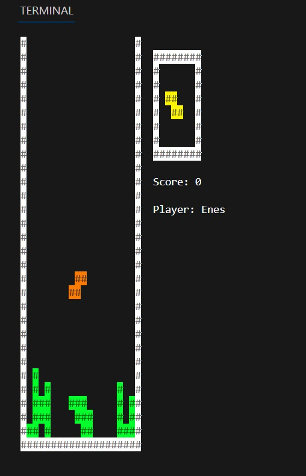

# Etetris

Multithreaded terminal Tetris game.

## Etetris Installation

---

### System Requirements

- Linux  
- GCC compiler  
- POSIX-compatible terminal 
- pthread support  

---

## Compile

Run this command in the project directory:

```bash
gcc etetris.c gameplay.c renderer.c scene.c tetromino.c physics_engine.c linked_list.c setup_stdio.c enes_util.c
```

After compilation, this file will be created:

```bash
a.out
```

---

## Run

Start the game with:

```bash
./a.out
```

---

## Controls

- A / D : Move left / right  
- S     : Move down  
- W     : Rotate  
- P     : Pause / Resume  
- R     : Reset score  
- X     : Reset piece position  
- Ctrl+C: Exit safely

# Etetris on terminal 


---

##  Modules Overview

### etetris.c
- Main entry point of the game
- Initializes the scene
- Creates walls, ground, score, nickname, and UI objects
- Starts renderer and input threads

---

### gameplay.c / gameplay.h
- Contains main game logic
- Handles user input (movement, rotation, pause)
- Controls tetromino falling speed
- Updates score
- Spawns new tetrominoes

---

### renderer.c / renderer.h
- Renders the game to the terminal
- Uses ANSI escape codes for colors
- Draws all scene objects every frame
- Runs in a separate thread

---

### scene.c / scene.h
- Manages game objects
- Adds, removes, and finds objects
- Stores global game state (score, pause, resolution)

---

### physics_engine.c / physics_engine.h
- Handles collision detection
- Checks whether a move or rotation is valid
- Prevents overlapping objects

---

### tetromino.c / tetromino.h
- Defines tetromino shapes
- Handles rotation logic
- Assigns colors to pieces

---

## Utility Modules

### enes_util.c / enes_util.h
- Random number generation
- String utilities
- Terminal helper functions

---

### linked_list.c / linked_list.h
- Implements a linked list
- Used as an input queue
- Stores keyboard inputs safely between threads

---

### setup_stdio.c / setup_stdio.h
- Configures terminal for raw input
- Disables echo and buffering
- Restores terminal on exit or crash

---

## Threading

- Renderer runs in its own thread
- Input handling runs in a separate thread
- Mutexes are used for safe data access

---

## Files Generated at Runtime

- score.txt  
  Stores player nickname and score when the game ends

---